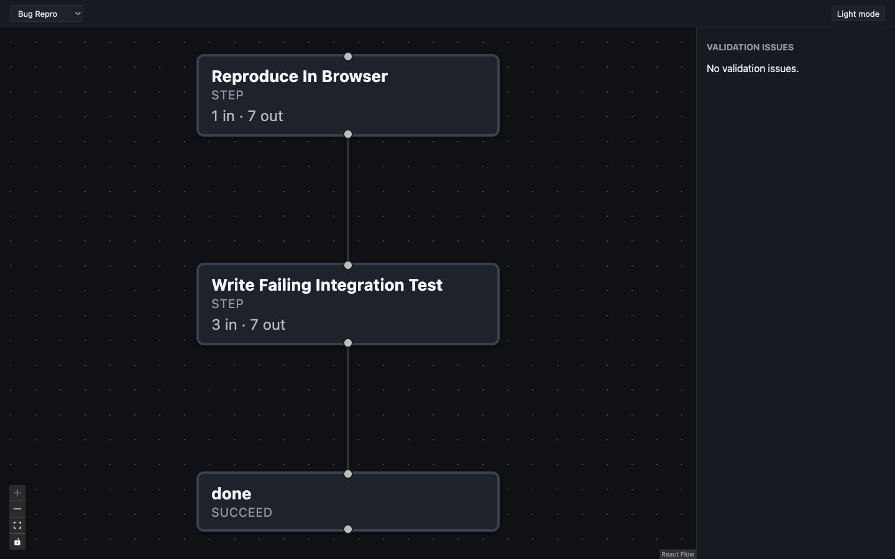

import { Steps, FileTree } from '@astrojs/starlight/components';
import Transcript from '../../../components/Transcript.astro';
import initTranscript from '../../transcripts/01-init.txt?raw';
import workItemTranscript from '../../transcripts/02-work-item.txt?raw';
import providerTranscript from '../../transcripts/03-provider.txt?raw';
import sessionTranscript from '../../transcripts/04-session-start.txt?raw';
import runOfferTranscript from '../../transcripts/05-run-offer.txt?raw';
import workerTranscript from '../../transcripts/06-worker.txt?raw';

:::tip[Have your assistant drive]
Using Claude Code, Codex, or Copilot? Paste this page's URL and say *follow
the Boboddy quickstart in this repo*. The docs are published as
[`llms-full.txt`](/boboddy/llms-full.txt) for exactly that.
:::

By the end you'll have a pipeline built around one of your own work items,
running on your machine. It takes about ten minutes in one terminal session;
the browser only comes in for sign-in, setup the terminal can't finish, and
the pipeline graph.

## Before you start

- A git repository with an `origin` remote.
- Node.js or Bun.
- Claude Code, Codex, or GitHub Copilot — or an API key from any AI provider.

Details are in [Installation](/boboddy/getting-started/installation/#requirements).
Steps that work inside your code run in a container, so the run may also need
Docker — see [Runtime](/boboddy/getting-started/concepts/#runtime).

<Steps>

1. **Install the CLI**

   ```bash
   npm i -g @boboddy/cli
   ```

   Prefer Bun? See [Installation](/boboddy/getting-started/installation/#install-the-cli).

2. **Link your repo**

   From anywhere inside your repository:

   ```bash
   boboddy init
   ```

   <Transcript src={initTranscript} />

   `init` signs you in, then finds or creates the
   [project](/boboddy/getting-started/concepts/#project) for this repo. The one
   decision is `Create Boboddy project … from GitHub?` — say yes, and your
   issues keep syncing in as work items. If it isn't asked, `init` opens a
   pre-filled page in your browser; pick your repo from GitHub there if you can
   (see [Connect GitHub or Jira](/boboddy/how-to/integrations/)).

   The notices need nothing from you. Answer yes to
   `Design your first pipeline now?`.

3. **Pick a work item**

   <Transcript src={workItemTranscript} />

   The designer builds every pipeline around one real
   [work item](/boboddy/getting-started/concepts/#work-item) — its interview
   asks how *this* item should be handled — so pick something typical. Not
   listed? Search, paste a ticket link, or describe one in a sentence.

4. <strong id="connect-your-ai-tool">Connect your AI tool</strong>

   The designer runs on a Boboddy-managed OpenCode runtime that needs its own
   connection to a model. The first time, it names the AI tools it finds and
   hands you OpenCode's provider menu.

   <Transcript src={providerTranscript} />

   Connect the tool you already have:

   | You have       | In the menu, pick                                                                                                                 |
   | -------------- | --------------------------------------------------------------------------------------------------------------------------------- |
   | Claude Code    | **Anthropic**, then paste an API key from console.anthropic.com — a Claude Pro/Max subscription can't be reused here             |
   | GitHub Copilot | **GitHub Copilot**, then **GitHub.com (Public)** (or **GitHub Enterprise**), and enter the device code at github.com/login/device |
   | Codex          | **OpenAI**, then **ChatGPT Pro/Plus (browser)** to use your ChatGPT subscription (or **Manually enter API Key**)                   |
   | None of these  | Any provider (Anthropic is recommended), then follow the prompts — see OpenCode's [Connecting providers](https://opencode.ai/docs/providers/) |

   It's one-time: the same connection runs your steps later. Boboddy never
   reads those tools' credentials. Already exported a key such as
   `ANTHROPIC_API_KEY`? This step is skipped.

5. **Talk to the designer**

   <Transcript src={sessionTranscript} />

   Your terminal becomes the
   [designer](/boboddy/getting-started/concepts/#the-designer), and your browser
   opens the [studio](/boboddy/getting-started/concepts/#the-studio): a live
   graph of the pipeline that redraws every time the designer saves a file.

   

   The designer reads your repository first, then interviews you about the
   item you picked, one question at a time:

   - *What should come out the other end?* What you'd want waiting in the
     morning, and what you'd need to see to trust it.
   - *What can the environment reach?* The tools you'd use for this item, step
     by step. "Nothing but the repository" is a fine answer.
   - *What must never be touched?* Production writes, customer data, anything
     that sends email or charges money.

   It proposes two or three ranked designs and builds the one you pick, plus
   the [default pipeline assignment](/boboddy/getting-started/concepts/#default-pipeline-assignment)
   that routes new items to it. With no `.devcontainer/devcontainer.json`, it
   writes one ([Runtime](/boboddy/getting-started/concepts/#runtime)). For a
   secret it asks only the variable name; you put the value in `.boboddy/.env`
   ([Secrets](/boboddy/guides/steps/#secrets)).

   Finally it typechecks and runs `boboddy pipelines push`, which always asks
   for permission. Say yes: that's the moment your pipeline reaches Boboddy.
   Then quit the designer with `/exit`.

6. **Run it**

   As the designer closes, it checks that your pipeline's first step can
   actually run, then asks whether to run it on your work item now:

   <Transcript src={runOfferTranscript} />

   Say yes. It queues the run and starts a
   [worker](/boboddy/getting-started/concepts/#worker) in the same terminal:

   <Transcript src={workerTranscript} />

   The worker polls until you press Ctrl+C. If the check or a step fails, run
   `boboddy pipelines design` again and tell the designer what happened. Said
   no? See [Run a pipeline on any work item](/boboddy/how-to/run-on-a-work-item/).

7. **Watch it in the dashboard**

   {/* Screenshot pending (docs onboarding plan, Phase 2d): the apps/next run page on the demo project, graph with one succeeded and one running node. */}

   Open your project in the
   [dashboard](/boboddy/getting-started/concepts/#dashboard), go to the
   *Executions* tab, and select the run. The run page shows the pipeline
   graph and each step's status. Select a step for its logs and output; its
   *Evaluation facts* are the [signals](/boboddy/getting-started/concepts/#signal)
   the step reported.

   Signals drive [advancement](/boboddy/getting-started/concepts/#advancement):
   the run moves on, or — when a `blockWhen` rule matches — stops as *Blocked*
   until a human steps in. That moment is the core of Boboddy.

</Steps>

## What you have now

<FileTree>

- my-repo/
  - .boboddy/
    - boboddy.jsonc the project id
    - .env.example secret variable names, only if a step needs any
    - pipeline-builder/
      - `<your-pipeline>.ts` the pipeline and its steps
      - default-pipeline-assignment.ts
      - package.json
      - …
  - .devcontainer/
    - devcontainer.json written by the designer if you had none

</FileTree>

Commit `.boboddy/` and `.devcontainer/`; the builder's `.gitignore` already
skips `node_modules/`, `push.ts`, and
[lockfiles](/boboddy/how-to/commit-your-pipeline/). Never commit
`.boboddy/.env`.

## Next

- [Change this pipeline](/boboddy/how-to/change-a-pipeline/) — run
  `boboddy pipelines design` again with another work item; it edits what's
  there instead of starting over.
- [Let a step read your repo](/boboddy/how-to/let-a-step-read-your-repo/) —
  when a step needs your code, it runs in your devcontainer.
- [Automate intake](/boboddy/how-to/integrations/) — connect GitHub or Jira, and
  route new items with
  [Default Pipeline Assignment](/boboddy/guides/pipeline-assignment/).
- [Scale workers](/boboddy/guides/workers/) — concurrency, polling, and work
  branches.

Rather write pipelines by hand? Start from
[`boboddy pipelines init`](/boboddy/reference/cli/#boboddy-pipelines-init).
