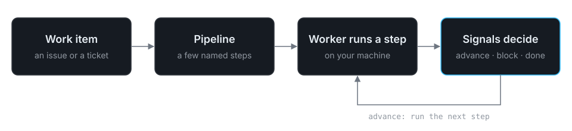

import { CardGrid, LinkCard } from '@astrojs/starlight/components';

Boboddy runs AI agents over your backlog, on your machines. You describe a
pipeline — a few steps, each one an agent with a prompt and a rule for what
counts as done — and a worker on your laptop or CI box runs it against each
work item that arrives, pausing for a human when the rules say so.



## You'll need

- A git repository with a remote — see [Installation](/boboddy/getting-started/installation/#requirements).
- Node.js or Bun — see [Installation](/boboddy/getting-started/installation/#requirements).
- Claude Code, Codex, or GitHub Copilot, or an API key from any AI provider — see
  [Installation](/boboddy/getting-started/installation/#requirements).

## Where to go next

<CardGrid>
  <LinkCard
    title="Quickstart"
    description="Ten minutes to a running pipeline."
    href="/boboddy/getting-started/quickstart/"
  />
  <LinkCard
    title="Core concepts"
    description="The dozen words the rest of the docs assume."
    href="/boboddy/getting-started/concepts/"
  />
  <LinkCard
    title="CLI reference"
    description="Every boboddy command and flag."
    href="/boboddy/reference/cli/"
  />
</CardGrid>

## Start now

```bash
npm i -g @boboddy/cli && boboddy init
```
